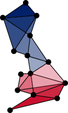

# The UK Network of BioImage Analysts

## Virtual bioimage analysis service \- open to all

Expert image analysis has become a critical bottleneck in life science research \- one that only deepens as imaging technologies continue to advance. As the first dedicated bioimage analysis service within the UK Node of Euro-BioImaging, UK-BIAS brings together leading specialists from ten UK institutions to address this challenge, complementing instrument access with image data analysis capabilities.

The network offers services covering the full experimental life cycle, from initial consultations to bespoke pipeline development, with resources equivalent to two full-time analysts. Our team has an excellent track record in research collaboration, with outputs published in top tier journals, as well as extensive experience in designing and delivering training programmes. We are strong advocates of the FAIR principles and, as such, all our outputs are released as open-source, while researchers retain full ownership of their raw data.

View an introductory presentation [here](presentations/intro/index.html).1
